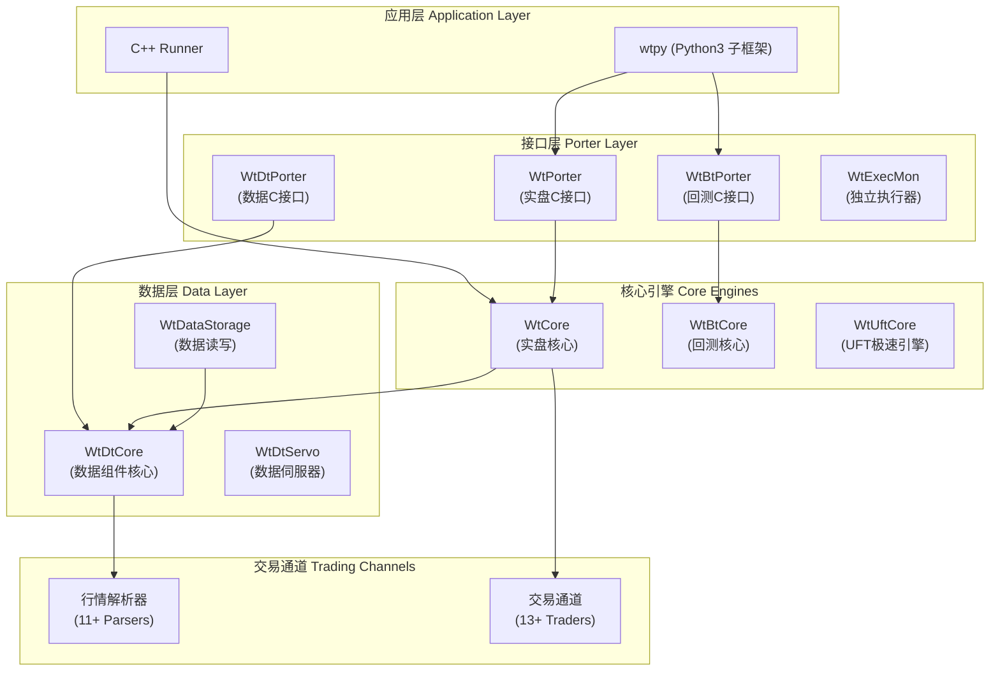
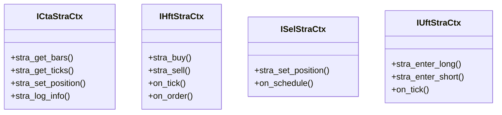

# WonderTrader 项目架构分析

## 项目概述

**WonderTrader** 是一个基于 C++ 核心模块的高性能量化交易开发框架，设计用于全市场、全品种交易场景。项目具有以下核心特点：

- 🚀 **高效率、高可用** - C++ 核心实现，系统延迟可低至 **175 纳秒**
- 🏢 **面向专业机构** - 支持数十亿级实盘管理规模
- 🔄 **全流程覆盖** - 从数据落地清洗、回测分析、实盘交易到运营调度

---

## 整体架构图



---

## 目录结构

```
wondertrader/
├── src/                    # C++ 源代码（核心）
│   ├── WtCore/            # 实盘交易核心库
│   ├── WtBtCore/          # 回测框架核心
│   ├── WtUftCore/         # UFT 极速引擎
│   ├── WtDtCore/          # 数据组件核心
│   ├── WtPorter/          # C 接口导出模块
│   ├── WtBtPorter/        # 回测 C 接口导出
│   ├── WtExeFact/         # 执行器工厂
│   ├── WtRiskMonFact/     # 风控工厂
│   ├── Parser*/           # 11+ 行情解析器
│   ├── Trader*/           # 13+ 交易通道
│   ├── Share/             # 公共工具库
│   └── Includes/          # 接口定义
├── dist/                   # 编译产出
├── docker/                 # Docker 配置
└── docs/                   # 文档
```

---

## 核心模块详解

### 1. 交易引擎 (Trading Engines)

WonderTrader 提供 **四种交易引擎**，适应不同的交易场景：

| 引擎 | 类型 | 驱动模式 | 延迟 | 适用场景 |
|------|------|----------|------|----------|
| **CTA Engine** | 同步策略引擎 | 事件+时间驱动 | ~微秒级 | 单标的择时、中频套利 |
| **SEL Engine** | 异步策略引擎 | 时间驱动 | - | 多因子选股、截面多空 |
| **HFT Engine** | 高频策略引擎 | 事件驱动 | **1-2 微秒** | 高频/低延时策略 |
| **UFT Engine** | 极速策略引擎 | 事件驱动 | **<200 纳秒** | 超高频/超低延时 |

#### 关键源文件

| 模块 | 路径 | 说明 |
|------|------|------|
| CTA 引擎 | [WtCtaEngine.cpp](file:///d:/gf_pc/WonderTrader/wondertrader/src/WtCore/WtCtaEngine.cpp) | CTA 策略引擎实现 |
| SEL 引擎 | [WtSelEngine.cpp](file:///d:/gf_pc/WonderTrader/wondertrader/src/WtCore/WtSelEngine.cpp) | 异步选股引擎 |
| HFT 引擎 | [WtHftEngine.cpp](file:///d:/gf_pc/WonderTrader/wondertrader/src/WtCore/WtHftEngine.cpp) | 高频策略引擎 |
| UFT 引擎 | [WtUftEngine.cpp](file:///d:/gf_pc/WonderTrader/wondertrader/src/WtUftCore/WtUftEngine.cpp) | 极速策略引擎 |
| 基础引擎 | [WtEngine.cpp](file:///d:/gf_pc/WonderTrader/wondertrader/src/WtCore/WtEngine.cpp) | 引擎基类 (~34KB) |

---

### 2. 策略上下文 (Strategy Context)

每种引擎对应独立的策略上下文，提供数据访问和信号接口：



接口定义位于：[src/Includes/](file:///d:/gf_pc/WonderTrader/wondertrader/src/Includes)
- [ICtaStraCtx.h](file:///d:/gf_pc/WonderTrader/wondertrader/src/Includes/ICtaStraCtx.h) - CTA 策略上下文接口
- [IHftStraCtx.h](file:///d:/gf_pc/WonderTrader/wondertrader/src/Includes/IHftStraCtx.h) - HFT 策略上下文接口
- [ISelStraCtx.h](file:///d:/gf_pc/WonderTrader/wondertrader/src/Includes/ISelStraCtx.h) - SEL 策略上下文接口
- [IUftStraCtx.h](file:///d:/gf_pc/WonderTrader/wondertrader/src/Includes/IUftStraCtx.h) - UFT 策略上下文接口

---

### 3. 回测框架 (Backtesting Framework)

位于 `src/WtBtCore/`，提供完整的回测支持：

| 组件 | 文件 | 说明 |
|------|------|------|
| CTA 回测 | [CtaMocker.cpp](file:///d:/gf_pc/WonderTrader/wondertrader/src/WtBtCore/CtaMocker.cpp) | CTA 策略回测器 (~65KB) |
| HFT 回测 | [HftMocker.cpp](file:///d:/gf_pc/WonderTrader/wondertrader/src/WtBtCore/HftMocker.cpp) | HFT 策略回测器 (~32KB) |
| SEL 回测 | [SelMocker.cpp](file:///d:/gf_pc/WonderTrader/wondertrader/src/WtBtCore/SelMocker.cpp) | SEL 策略回测器 (~33KB) |
| UFT 回测 | [UftMocker.cpp](file:///d:/gf_pc/WonderTrader/wondertrader/src/WtBtCore/UftMocker.cpp) | UFT 策略回测器 (~35KB) |
| 数据回放 | [HisDataReplayer.cpp](file:///d:/gf_pc/WonderTrader/wondertrader/src/WtBtCore/HisDataReplayer.cpp) | 历史数据回放器 (**~127KB**) |
| 撮合引擎 | [MatchEngine.cpp](file:///d:/gf_pc/WonderTrader/wondertrader/src/WtBtCore/MatchEngine.cpp) | 回测撮合引擎 |
| 执行回测 | [ExecMocker.cpp](file:///d:/gf_pc/WonderTrader/wondertrader/src/WtBtCore/ExecMocker.cpp) | 执行单元回测 |

---

### 4. 数据组件 (Data Components)

**数据核心** (`src/WtDtCore/`)

| 组件 | 文件 | 说明 |
|------|------|------|
| 数据管理 | [DataManager.cpp](file:///d:/gf_pc/WonderTrader/wondertrader/src/WtDtCore/DataManager.cpp) | 数据管理中心 |
| 状态监控 | [StateMonitor.cpp](file:///d:/gf_pc/WonderTrader/wondertrader/src/WtDtCore/StateMonitor.cpp) | 交易状态监控 |
| UDP 广播 | [UDPCaster.cpp](file:///d:/gf_pc/WonderTrader/wondertrader/src/WtDtCore/UDPCaster.cpp) | UDP 行情广播 |
| 共享内存 | [ShmCaster.cpp](file:///d:/gf_pc/WonderTrader/wondertrader/src/WtDtCore/ShmCaster.cpp) | 共享内存广播 |
| 指数合成 | [IndexWorker.cpp](file:///d:/gf_pc/WonderTrader/wondertrader/src/WtDtCore/IndexWorker.cpp) | 自定义指数 |

**数据存储** (`src/WtDataStorage/`)

| 组件 | 文件 | 说明 |
|------|------|------|
| 数据读取 | [WtDataReader.cpp](file:///d:/gf_pc/WonderTrader/wondertrader/src/WtDataStorage/WtDataReader.cpp) | 标准数据读取 (~64KB) |
| 数据写入 | [WtDataWriter.cpp](file:///d:/gf_pc/WonderTrader/wondertrader/src/WtDataStorage/WtDataWriter.cpp) | 数据落地 (~77KB) |
| 随机读取 | [WtRdmDtReader.cpp](file:///d:/gf_pc/WonderTrader/wondertrader/src/WtDataStorage/WtRdmDtReader.cpp) | 随机访问数据 (~80KB) |

---

### 5. 行情解析器 (Parsers)

位于 `src/Parser*/`，支持多种行情源：

| 市场 | 解析器 | 说明 |
|------|--------|------|
| 期货 | `ParserCTP` | CTP 行情通道 |
| 期货 | `ParserCTPMini` | CTPMini 行情通道 |
| 期货 | `ParserFemas` | 飞马行情通道 |
| 期货 | `ParserYD` | 易达行情通道 |
| 期货 | `ParserXeleSkt` | 艾克朗科组播行情 |
| 期权 | `ParserCTPOpt` | CTPOpt 期权行情 |
| 股票 | `ParserXTP` | XTP 股票行情 |
| 股票 | `ParserHuaX` | 华鑫奇点行情 |
| 股票 | `ParserOES` | 宽睿行情 |
| 通用 | `ParserUDP` | UDP 广播接收 |
| 通用 | `ParserShm` | 共享内存接收 |

接口定义：[IParserApi.h](file:///d:/gf_pc/WonderTrader/wondertrader/src/Includes/IParserApi.h)

---

### 6. 交易通道 (Traders)

位于 `src/Trader*/`，支持多种交易柜台：

| 市场 | 交易模块 | 说明 |
|------|----------|------|
| 期货 | `TraderCTP` | CTP 柜台 |
| 期货 | `TraderCTPMini` | CTPMini 柜台 |
| 期货 | `TraderFemas` | 飞马柜台 |
| 期货 | `TraderYD` | 易达柜台 |
| 期权 | `TraderCTPOpt` | CTPOpt 期权交易 |
| 股票 | `TraderXTP` | XTP 股票交易 |
| 股票 | `TraderXTPXAlgo` | XTP 算法交易 |
| 股票 | `TraderATP` | 华锐 ATP |
| 股票 | `TraderOES` | 宽睿 OES |
| 股票 | `TraderHuaX` | 华鑫奇点 |
| 仿真 | `TraderMocker` | 本地仿真撮合 |

接口定义：[ITraderApi.h](file:///d:/gf_pc/WonderTrader/wondertrader/src/Includes/ITraderApi.h)

核心实现：[TraderAdapter.cpp](file:///d:/gf_pc/WonderTrader/wondertrader/src/WtCore/TraderAdapter.cpp) (~71KB)

---

### 7. 执行单元 (Execution Units)

位于 `src/WtExeFact/`，提供多种算法执行策略：

| 执行单元 | 文件 | 算法说明 |
|----------|------|----------|
| MinImpact | [WtMinImpactExeUnit.cpp](file:///d:/gf_pc/WonderTrader/wondertrader/src/WtExeFact/WtMinImpactExeUnit.cpp) | 最小冲击成本 |
| TWAP | [WtTWapExeUnit.cpp](file:///d:/gf_pc/WonderTrader/wondertrader/src/WtExeFact/WtTWapExeUnit.cpp) | 时间加权均价 |
| VWAP | [WtVWapExeUnit.cpp](file:///d:/gf_pc/WonderTrader/wondertrader/src/WtExeFact/WtVWapExeUnit.cpp) | 成交量加权均价 |
| StockMinImpact | [WtStockMinImpactExeUnit.cpp](file:///d:/gf_pc/WonderTrader/wondertrader/src/WtExeFact/WtStockMinImpactExeUnit.cpp) | 股票最小冲击 |
| StockVWAP | [WtStockVWapExeUnit.cpp](file:///d:/gf_pc/WonderTrader/wondertrader/src/WtExeFact/WtStockVWapExeUnit.cpp) | 股票 VWAP |
| DiffMinImpact | [WtDiffMinImpactExeUnit.cpp](file:///d:/gf_pc/WonderTrader/wondertrader/src/WtExeFact/WtDiffMinImpactExeUnit.cpp) | 差异化最小冲击 |

接口定义：[ExecuteDefs.h](file:///d:/gf_pc/WonderTrader/wondertrader/src/Includes/ExecuteDefs.h)

---

### 8. 风控模块 (Risk Control)

位于 `src/WtRiskMonFact/`：

| 组件 | 文件 | 说明 |
|------|------|------|
| 风控工厂 | [WtRiskMonFact.cpp](file:///d:/gf_pc/WonderTrader/wondertrader/src/WtRiskMonFact/WtRiskMonFact.cpp) | 风控单元工厂 |
| 简单风控 | [WtSimpRiskMon.cpp](file:///d:/gf_pc/WonderTrader/wondertrader/src/WtRiskMonFact/WtSimpRiskMon.cpp) | 组合盘资金风控 |

接口定义：[RiskMonDefs.h](file:///d:/gf_pc/WonderTrader/wondertrader/src/Includes/RiskMonDefs.h)

支持的风控维度：
- **组合盘资金风控** - 虚拟资金管理
- **通道流量风控** - 合规风险控制
- **账户资金风控** - 账户回撤控制
- **离合器机制** - 信号执行断开

---

### 9. C 接口导出层 (Porter Layer)

位于 `src/WtPorter/`：

| 文件 | 说明 |
|------|------|
| [WtPorter.h](file:///d:/gf_pc/WonderTrader/wondertrader/src/WtPorter/WtPorter.h) | C 接口头文件 (~12KB) |
| [WtPorter.cpp](file:///d:/gf_pc/WonderTrader/wondertrader/src/WtPorter/WtPorter.cpp) | C 接口实现 (~28KB) |
| [WtRtRunner.cpp](file:///d:/gf_pc/WonderTrader/wondertrader/src/WtPorter/WtRtRunner.cpp) | 运行时管理器 (~32KB) |

Porter 层是 `wtpy` Python 框架与 C++ 核心交互的桥梁。

---

### 10. 基础库与数据结构 (Base Libraries)

**Share 模块** (`src/Share/`)

| 文件 | 说明 |
|------|------|
| [CodeHelper.hpp](file:///d:/gf_pc/WonderTrader/wondertrader/src/Share/CodeHelper.hpp) | 合约代码工具 (~16KB) |
| [StrUtil.hpp](file:///d:/gf_pc/WonderTrader/wondertrader/src/Share/StrUtil.hpp) | 字符串工具 (~14KB) |
| [TimeUtils.hpp](file:///d:/gf_pc/WonderTrader/wondertrader/src/Share/TimeUtils.hpp) | 时间工具 (~10KB) |
| [BoostFile.hpp](file:///d:/gf_pc/WonderTrader/wondertrader/src/Share/BoostFile.hpp) | 文件操作封装 |
| [threadpool.hpp](file:///d:/gf_pc/WonderTrader/wondertrader/src/Share/threadpool.hpp) | 线程池 |

**核心数据结构** (`src/Includes/`)

| 文件 | 说明 |
|------|------|
| [WTSDataDef.hpp](file:///d:/gf_pc/WonderTrader/wondertrader/src/Includes/WTSDataDef.hpp) | Tick/Bar/OrderQueue 等行情数据定义 (~34KB) |
| [WTSTradeDef.hpp](file:///d:/gf_pc/WonderTrader/wondertrader/src/Includes/WTSTradeDef.hpp) | 委托/成交/持仓等交易数据定义 (~24KB) |
| [WTSContractInfo.hpp](file:///d:/gf_pc/WonderTrader/wondertrader/src/Includes/WTSContractInfo.hpp) | 合约信息定义 (~11KB) |
| [WTSSessionInfo.hpp](file:///d:/gf_pc/WonderTrader/wondertrader/src/Includes/WTSSessionInfo.hpp) | 交易时段定义 (~14KB) |
| [WTSVariant.hpp](file:///d:/gf_pc/WonderTrader/wondertrader/src/Includes/WTSVariant.hpp) | 变体类型（配置解析）|

---

## 解决方案文件

项目提供多个 Visual Studio 解决方案（`.sln`），按功能模块划分：

| 文件 | 包含模块 |
|------|----------|
| [all.sln](file:///d:/gf_pc/WonderTrader/wondertrader/src/all.sln) | 全部模块 |
| [product.sln](file:///d:/gf_pc/WonderTrader/wondertrader/src/product.sln) | 实盘核心模块 |
| [backtest.sln](file:///d:/gf_pc/WonderTrader/wondertrader/src/backtest.sln) | 回测模块 |
| [datakit.sln](file:///d:/gf_pc/WonderTrader/wondertrader/src/datakit.sln) | 数据组件 |
| [parsers.sln](file:///d:/gf_pc/WonderTrader/wondertrader/src/parsers.sln) | 行情解析器 |
| [traders.sln](file:///d:/gf_pc/WonderTrader/wondertrader/src/traders.sln) | 交易通道 |
| [uft.sln](file:///d:/gf_pc/WonderTrader/wondertrader/src/uft.sln) | UFT 极速引擎 |
| [tools.sln](file:///d:/gf_pc/WonderTrader/wondertrader/src/tools.sln) | 工具模块 |

---

## 开发环境

- **Windows**: Visual Studio 2017 + Windows 10
- **Linux**: GCC 8.4.0 + CMake 3.17.5

**依赖库**：
- [Boost 1.72](https://www.boost.org/)
- [RapidJSON 1.0.2](https://github.com/Tencent/rapidjson)
- [spdlog 1.9.2](https://github.com/gabime/spdlog)
- [nanomsg 1.1.5](https://github.com/nanomsg/nanomsg)

---

## 扩展点

### 1. 添加新策略

实现对应的策略工厂和策略类：
- CTA: 继承 `CtaStrategy` 接口 → 参考 [WtCtaStraFact](file:///d:/gf_pc/WonderTrader/wondertrader/src/WtCtaStraFact)
- HFT: 继承 `HftStrategy` 接口 → 参考 [WtHftStraFact](file:///d:/gf_pc/WonderTrader/wondertrader/src/WtHftStraFact)
- SEL: 继承 `SelStrategy` 接口 → 参考 [WtSelStraFact](file:///d:/gf_pc/WonderTrader/wondertrader/src/WtSelStraFact)
- UFT: 继承 `UftStrategy` 接口 → 参考 [WtUftStraFact](file:///d:/gf_pc/WonderTrader/wondertrader/src/WtUftStraFact)

### 2. 添加新行情源

实现 `IParserApi` 接口，参考现有 `Parser*` 模块

### 3. 添加新交易通道

实现 `ITraderApi` 接口，参考现有 `Trader*` 模块

### 4. 添加新执行算法

实现 `ExecuteUnit` 接口，在 `WtExeFact` 中注册

---

## 相关资源

- 📚 [官方文档](https://docs.wondertrader.com/)
- 🐍 [wtpy Python 框架](https://github.com/wondertrader/wtpy)
- 📝 [更新日志](file:///d:/gf_pc/WonderTrader/wondertrader/updatelog.md)
